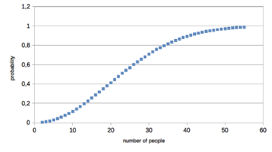

# Birthday problem with montecarlo
Simulates birthday problem with monte carlo simulation.

More informations about the problem [here](https://duckduckgo.com/?q=birthday+problem).

#how to run
compile: `g++ -O3 -Ilib/ -Llib -lstatusbar main.cpp -o montecarlobirthday.out`

run: `./birthday.out`

note the `-O3` flags, it drastically reduces time of esecutions!

#how it works
*ExpeimentI* generates `n=500000` **groups of people** with random birthday during a **year**, then checks how may groups have got almost two people born in the same day.

*ExperimentII* still call people with **random birthday** until **two have the same**, it does it `n=500000` times then tells the average number of people needed.

You can check that for about 23 people the probability of find *two people with same birthday* is near **50%**!

#random
this program uses a special `yearrand()` function, which returns a random integer based on **real data** provided by *italian statistic institute* about date of born in 2014 in Italy.

source: [http://demo.istat.it/altridati/IscrittiNascita/](https://archive.is/modaz)

I did this (you can do the same):
* got data from [here](http://demo.istat.it/altridati/IscrittiNascita/2014/T2.8.xls)
* fit the data with a polinomial (grade 3) function
* generate random number between 1 and 365 based on that distribution

#license
See [LICENSE](LICENSE)
